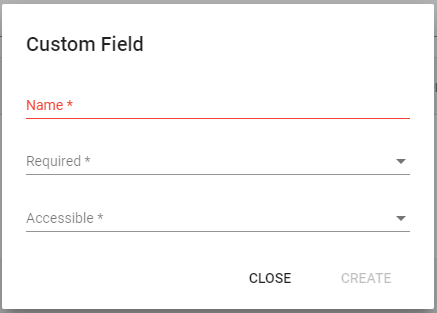

# Custom License Fields

Using custom fields you can store additional license data alongside product keys which can be accessed in your application. This can include additional information about customers \(e.g. their name, company etc.\), additional options to enable or disable specific features in your application etc. Any number of custom fields can be associated with a product key.

## Adding a Custom yField

On the "Product Version" page, click "Custom Fields".

On the "Custom Fields" page, click "Plus symbol" button and fill in all the values in the fields in the custom fields dialog box.

### **Name **

This is the name of the custom field.

### **Required **

Choosing if the field is necessarily required to be filled or not at the time of creation of product key.

### **Accessible **

If this property is set to true once then on activation of the product key the field data is accessible in the app. So, after user has activated your app, you can use LexActivator API function `GetCustomLicenseField()` to access the field value.

## Using a Custom License Field

Once you have created a license field, it will appear in the "Product Key" dialog where it can be filled when generating a product key. Alternately, it can be passed in the Web API when generating a key.

## Updating a Custom License Field and getting changes in your application

Whenever you change the field data for a product key either within your Cryptlex dashboard or using the web API, then updated data will automatically be accessible to you in your app, when your customer re-activates or`IsProductGenuine()`function \(periodically\) checks with Cryptlex servers.

