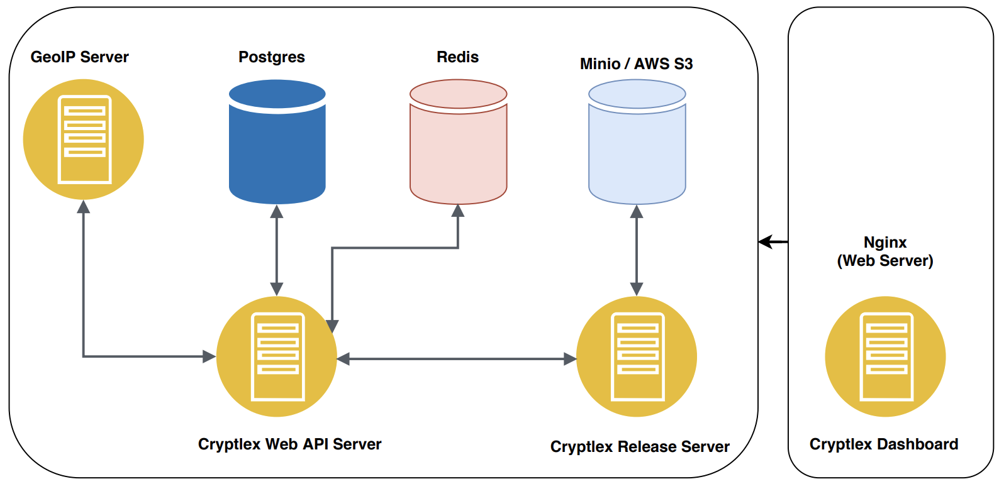
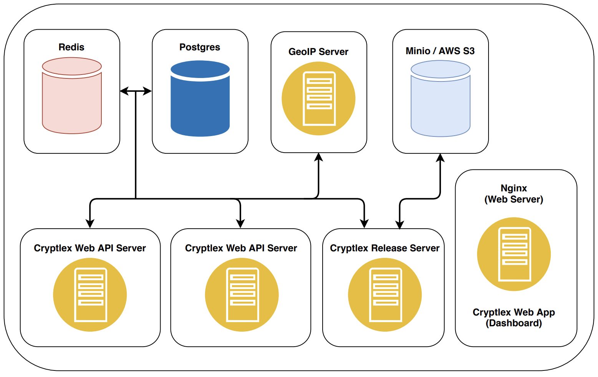

# Server Layout

To help you determine the best server layout, look over the diagrams below, and determine which layout works best for your dev/testing and production environments.

Each layout will require the Cryptlex Web API server, Cryptlex Release server, Cryptlex GeoIP server, Postgres, Redis, and Nginx \(for hosting the Cryptlex dashboard\) web server .

The Cryptlex services are separated because as you will see in the diagrams below they may not all run on the same server, and each component can be horizontally scaled separately. 

## Single server

This configuration uses a single server to host all of the components for Cryptlex including the web dashboard. In this deployment model, there is no service redundancy and there is a risk of resource contention. For this reason, this model should be limited to the following purposes:

* Development servers or workstations
* Small production deployments

## Multiple servers with an external database

This configuration uses separate servers to host all the services. The method for configuring this database is outside the scope of this guide but a general guideline would be to provide some sort of storage redundancy or clustering capability to ensure a high level of availability and performance. For the file store, it is recommended to use AWS S3.

Each Cryptlex Web API service is redundant and running on a separate server, this configuration provides basic redundancy.

In this scenario, Cryptlex should be placed behind a load balancer to utilize all services equally. Cryptlex doesn't use cookies, so sticky sessions are not required to be configured in the load balancer. This configuration is best suited for the following purposes:

* Staging environments
* Production deployments

